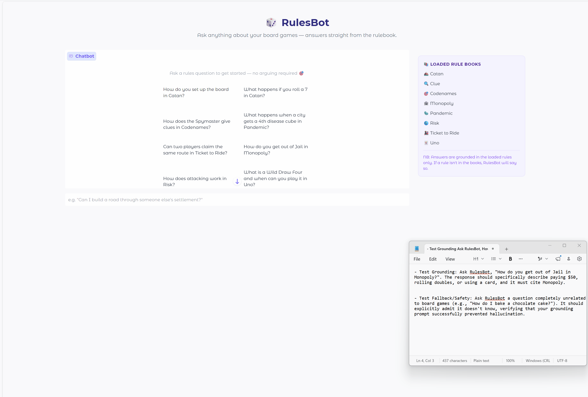

# 🎲 RulesBot 

# 👉 [Read Me](README.md) | [AI Bill of Materials (AI-BOM)](AIBOM.md) | [Model Card](model_card.md) |

> A board game rules assistant — because "just read the rulebook" isn't always helpful at 11pm on game night.

RulesBot answers natural language questions about board game rules using a RAG (Retrieval-Augmented Generation) pipeline. Ask it anything: it retrieves relevant rule passages and generates an answer grounded in the actual text.

**This is a starter repo.** The UI and infrastructure are built. The retrieval and generation pipeline is yours to implement.

## Walkthrough Demo


---

## Getting Started

### 1. Fork and clone

Fork this repo, then clone your fork locally.

### 2. Create a virtual environment

```bash
python -m venv .venv
source .venv/bin/activate      # Mac/Linux
# or: .venv\Scripts\activate   # Windows
```

### NB: DevSecOps Local Setup Instructions
Step 1: Install the Python-based Tools
Ensure your virtual environment is activated, then install the security and linting tools via pip.
```bash
pip install bandit pip-audit black flake8
```

Step 2: Run Code Formatting (Black)
Black is an uncompromising code formatter. Running it ensures your code adheres to professional PEP8 standards.
```bash
black .
```

Step 3: Run Code Linting (Flake8)
Flake8 checks your code for stylistic errors, undefined names, and unused imports.
```bash
flake8 .
```

Step 4: Run Static Application Security Testing (Bandit)
Bandit scans your Python code for common security issues. The -ll flag tells it to only report medium and high severity issues.
After running the command, double-click the newly created bandit_report.html file in your project directory (or open it via your browser), and you will be able to review the security findings in a visual format. (GUI).

```bash
bandit -r . -ll
bandit -r . -f html -o bandit_report.html
```

Step 5: Run Dependency Vulnerability Scanning (Pip-Audit)
This checks your requirements.txt against known Common Vulnerabilities and Exposures (CVEs) databases.
```bash
pip-audit -r requirements.txt
```

Step 6: Install and Run Secret Scanning (Gitleaks)
Gitleaks prevents you from accidentally committing API keys (like your Groq key) to GitHub. It is a standalone binary rather than a Python package.
**For MacOS:**
```bash
brew install gitleaks
gitleaks detect --source . -v
```
**For Windows / Linux (via Docker):**
```bash
docker run -v ${PWD}:/path zricethezav/gitleaks:latest detect --source="/path" -v
Using WinGet: winget install -e --id Gitleaks.Gitleaks
Using Scoop: scoop install gitleaks
```

### 3. Install dependencies

```bash
pip install -r requirements.txt
```

> **Note:** `sentence-transformers` will download the embedding model (~80MB) on first run. This only happens once — it's cached locally afterward.

### 4. Add your Groq API key

```bash
cp .env.example .env
```

Open `.env` and replace `your_key_here` with your key from [console.groq.com](https://console.groq.com). No credit card required.

### 5. Run the app

```bash
python app.py
```

RulesBot will start and open in your browser. Before you implement the retrieval pipeline, it will load and display the UI but won't be able to answer questions.

---

## Project Structure

```
ai201-lab1-rulesbot-starter/
├── app.py              # Gradio UI and startup logic — fully built
├── config.py           # Settings (models, paths, retrieval params) — fully built
├── ingest.py           # Document loading + chunking — TODO: chunk_document()
├── retriever.py        # Vector store + semantic search — TODO: embed_and_store(), retrieve()
├── generator.py        # LLM response generation — TODO: generate_response()
├── docs/               # Board game rule documents (pre-loaded)
│   ├── catan.txt
│   ├── clue.txt
│   ├── codenames.txt
│   ├── monopoly.txt
│   ├── pandemic.txt
│   ├── risk.txt
│   ├── ticket_to_ride.txt
│   └── uno.txt
├── specs/              # Design documents — start here before writing any code
│   ├── system-design.md         # Complete — read this first
│   ├── chunk-document-spec.md   # Partial — you complete before Milestone 1
│   ├── retrieve-spec.md         # Partial — you complete before Milestone 2
│   └── generate-response-spec.md # Partial — you complete before Milestone 3
└── planning.md         # Your observations and reflections — fill in as you go
```

## Where to Start

Before opening any `.py` file, read `specs/system-design.md`. It explains what's built, what's left for you, and why the technical decisions were made. Each milestone then begins by completing the corresponding spec file before writing code — that spec becomes the brief you hand to your AI tool when you're ready to implement.

---

## Re-ingesting After Changes

ChromaDB persists to disk in `./chroma_db`. If you change your chunking strategy and want to re-ingest, delete that folder and restart the app:

```bash
rm -rf chroma_db/   # Mac/Linux
# or: rmdir /s chroma_db   # Windows
# On Windows: Also use cmd /c rmdir /s /q chroma_db or 
# Powershell: Remove-Item -Recurse -Force .\chroma_db
python app.py

# To improve start-up time, Use python -c "from sentence_transformers import SentenceTransformer; SentenceTransformer('all-MiniLM-L6-v2')"
# This will pre-download the model
# You can also load the ingestion manually instead. 
```

---

## Rule Books Included

| Game | File |
|------|------|
| Catan | `docs/catan.txt` |
| Clue | `docs/clue.txt` |
| Codenames | `docs/codenames.txt` |
| Monopoly | `docs/monopoly.txt` |
| Pandemic | `docs/pandemic.txt` |
| Risk | `docs/risk.txt` |
| Ticket to Ride | `docs/ticket_to_ride.txt` |
| Uno | `docs/uno.txt` |
